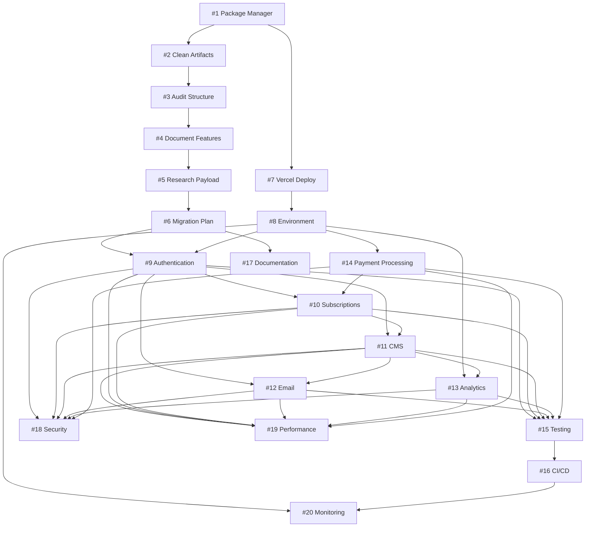

# Implementation Roadmap - Substack Clone Pivot

## Overview
This document outlines the implementation order and dependencies for all 20 GitHub issues. Issues are grouped into sprints based on dependencies and priority.

## Critical Path
The following issues are on the critical path and must be completed in order:
1. **Issue #1** → **Issue #7** → **Issue #8** → **Issue #9** → **Issue #10** → Production Launch

## Sprint Organization

### 🔴 Sprint 0: Foundation (Week 1)
**Goal:** Fix immediate blockers and stabilize development environment

| Issue | Title | Dependencies | Human Actions |
|-------|-------|--------------|---------------|
| #1 | Package Manager Standardization | None | **DECISION:** Choose package manager |
| #2 | Clean Test Artifacts | #1 | Review files to remove |
| #7 | Fix Vercel Deployment | #1 | **ACCESS:** Vercel settings |
| #8 | Environment Configuration | #7 | **PROVIDE:** API keys |

### 📊 Sprint 1: Analysis & Planning (Week 1-2)
**Goal:** Understand current state and plan migration

| Issue | Title | Dependencies | Human Actions |
|-------|-------|--------------|---------------|
| #3 | Audit Project Structure | #1, #2 | **PROVIDE:** Supabase credentials |
| #4 | Document Current Features | #3 | **DECISION:** Features to keep/deprecate |
| #5 | Research Payload CMS | #3, #4 | **DECISION:** Go/no-go on Payload |
| #6 | Create Migration Plan | #5 | **APPROVAL:** Migration approach |

### 💰 Sprint 2: Payment Infrastructure (Week 2-3)
**Goal:** Set up payment processing foundation

| Issue | Title | Dependencies | Human Actions |
|-------|-------|--------------|---------------|
| #14 | Payment Processing | #8 | **CREATE:** Stripe account, **PROVIDE:** Keys |
| #9 | Authentication System | #6, #8 | **DECISION:** Social login providers |
| #10 | Subscription Management | #9, #14 | **DEFINE:** Pricing tiers |

### ✍️ Sprint 3: Content & Communication (Week 3-4)
**Goal:** Build core content and communication features

| Issue | Title | Dependencies | Human Actions |
|-------|-------|--------------|---------------|
| #11 | Content Management System | #9, #10 | **DECISION:** Rich text editor |
| #12 | Email Notifications | #9, #11 | **SELECT:** Email provider |
| #13 | Analytics Tracking | #8, #11 | **SELECT:** Analytics provider |

### ✅ Sprint 4: Quality & Testing (Week 4-5)
**Goal:** Ensure quality and establish testing practices

| Issue | Title | Dependencies | Human Actions |
|-------|-------|--------------|---------------|
| #15 | Testing Strategy | #9-14 | **DEFINE:** Test requirements |
| #16 | CI/CD Pipeline | #15 | **CONFIGURE:** GitHub secrets |
| #17 | Documentation | #6 | **REVIEW:** Documentation |

### 🚀 Sprint 5: Production Readiness (Week 5-6)
**Goal:** Optimize, secure, and prepare for launch

| Issue | Title | Dependencies | Human Actions |
|-------|-------|--------------|---------------|
| #18 | Security Audit | #9-14 | **HIRE:** Security consultant |
| #19 | Performance Optimization | #11, #9-14 | **CONFIGURE:** CDN |
| #20 | Monitoring & Error Tracking | #8, #16 | **CREATE:** Monitoring accounts |

## Dependency Graph

## Human Action Items Summary

### Immediate Decisions Needed
- [ ] **Package manager choice** (npm/yarn/pnpm) - Issue #1
- [ ] **Migration approach** (incremental vs parallel) - Issue #6
- [ ] **Payload CMS decision** (go/no-go) - Issue #5

### Access Required
- [ ] **Vercel project settings** - Issue #7
- [ ] **Supabase credentials** - Issue #3
- [ ] **GitHub repository settings** - Issue #16

### Accounts to Create
- [ ] **Stripe account** - Issue #14
- [ ] **Email service provider** - Issue #12
- [ ] **Analytics provider** - Issue #13
- [ ] **Error tracking service** - Issue #20

### Configuration Required
- [ ] **API keys and secrets** - Issue #8
- [ ] **Domain and DNS settings** - Issue #7
- [ ] **OAuth app credentials** - Issue #9
- [ ] **Webhook endpoints** - Issue #14

## Parallel Work Opportunities

### Can be done in parallel:
- Issues #3, #4, #5 (Analysis tasks)
- Issues #13, #15 (Analytics & Testing)
- Issues #17, #19, #20 (Documentation & Optimization)

### Must be sequential:
- Issue #1 → All others (blocker)
- Issue #14 → Issue #10 (payment before subscriptions)
- Issue #9 → Issues #10, #11, #12 (auth before features)

## Risk Mitigation

### High-Risk Areas
1. **Payment Integration** - Test thoroughly in Stripe test mode
2. **Authentication** - Implement rate limiting and security measures
3. **Data Migration** - Create backups and rollback plans
4. **Performance** - Monitor bundle sizes continuously

### Contingency Plans
- **Vercel deployment fails:** Use alternative hosting (Railway, Render)
- **Payload CMS not suitable:** Continue with current Supabase setup
- **Payment integration complex:** Consider using Stripe Checkout hosted solution

## Success Metrics
- [ ] All tests passing (>80% coverage)
- [ ] Lighthouse score >90
- [ ] Zero critical security vulnerabilities
- [ ] Successful deployment to production
- [ ] Core features functional

## Notes for Implementation
1. **Start with Issue #1 immediately** - It blocks everything else
2. **Run Issues #3-5 in parallel** after foundation is fixed
3. **Prioritize auth and payments** - They enable monetization
4. **Leave optimization for last** - Get features working first
5. **Document as you go** - Don't leave it all for Issue #17