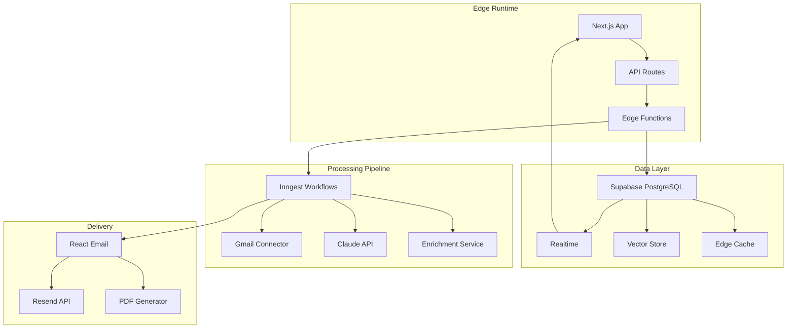

# Technical Design Document
## Substack Intelligence Platform - Modern Stack Implementation

**Version:** 2.0 (Expert Implementation)  
**Date:** November 2024  
**Stack:** Next.js 14 + Vercel + Supabase + Clerk  
**AI-Optimized:** Built for Claude Code Implementation  
**Status:** Implementation Ready

---

## 1. Executive Technical Summary

We're building a modern, type-safe venture intelligence platform using edge-native architecture. This implementation leverages Vercel's edge runtime for global performance, Supabase for real-time data synchronization, and Clerk for enterprise-grade authentication.

### 1.1 Expert Architecture Principles
- **Edge-First**: Computation at the edge for minimal latency
- **Type-Safe**: End-to-end TypeScript with Zod validation
- **AI-Native**: Designed for Claude Code pair programming
- **Event-Driven**: Real-time updates via Supabase subscriptions
- **Observable**: OpenTelemetry instrumentation throughout

### 1.2 Stack Justification

| Layer | Technology | Expert Rationale |
|-------|------------|------------------|
| Framework | Next.js 14 App Router | RSC for optimal performance, built-in caching |
| Runtime | Vercel Edge Functions | Global deployment, automatic scaling |
| Database | Supabase (PostgreSQL) | Real-time subscriptions, Row Level Security |
| Auth | Clerk | B2B ready, org management, SOC2 compliant |
| Queue | Inngest | Declarative workflows, automatic retries |
| Email | Resend | Developer-friendly, React email templates |
| LLM | Anthropic Claude 3 | Superior accuracy for extraction tasks |
| Monitoring | Axiom | Edge-compatible, structured logging |
| Analytics | PostHog | Privacy-first product analytics |

---

## 2. Advanced Architecture

### 2.1 System Design



### 2.2 Data Flow Architecture

```typescript
// Type-safe data flow with Zod schemas
const CompanyMention = z.object({
  id: z.string().uuid(),
  name: z.string().min(1),
  description: z.string().nullable(),
  context: z.string(),
  sentiment: z.enum(['positive', 'negative', 'neutral']),
  confidence: z.number().min(0).max(1),
  metadata: z.object({
    sourceEmailId: z.string(),
    newsletterName: z.string(),
    extractedAt: z.string().datetime(),
    enrichedAt: z.string().datetime().optional()
  })
});

type CompanyMention = z.infer<typeof CompanyMention>;
```

---

## 3. Expert Implementation Guide

### 3.1 Project Structure (Claude Code Optimized)

```
substack-intelligence/
├── apps/
│   ├── web/                 # Next.js 14 app
│   │   ├── app/            
│   │   │   ├── (auth)/     # Clerk-protected routes
│   │   │   ├── api/        # API routes
│   │   │   └── (dashboard)/
│   │   ├── components/      # React components
│   │   ├── lib/            # Utilities
│   │   └── hooks/          # Custom React hooks
│   └── email/              # React Email templates
├── packages/
│   ├── database/           # Supabase client & types
│   ├── shared/             # Shared types & schemas
│   └── ai/                 # LLM abstractions
├── services/
│   ├── ingestion/          # Email processing
│   ├── extraction/         # Claude integration
│   └── enrichment/         # Company data enrichment
└── infrastructure/
    ├── supabase/           # Database migrations
    └── monitoring/         # Observability config
```

### 3.2 Core Services Implementation

#### 3.2.1 Email Ingestion Service

```typescript
// services/ingestion/gmail-connector.ts
import { google } from 'googleapis';
import { createClient } from '@supabase/supabase-js';
import { z } from 'zod';
import { instrument } from '@axiomhq/js';

const GmailMessageSchema = z.object({
  id: z.string(),
  threadId: z.string(),
  payload: z.object({
    headers: z.array(z.object({
      name: z.string(),
      value: z.string()
    })),
    body: z.object({
      data: z.string().optional()
    }).optional(),
    parts: z.array(z.any()).optional()
  })
});

@instrument({ name: 'GmailConnector' })
export class GmailConnector {
  private gmail;
  private supabase;
  
  constructor(auth: OAuth2Client) {
    this.gmail = google.gmail({ version: 'v1', auth });
    this.supabase = createClient(
      process.env.NEXT_PUBLIC_SUPABASE_URL!,
      process.env.SUPABASE_SERVICE_KEY!
    );
  }

  async fetchDailySubstacks(): Promise<ProcessedEmail[]> {
    const yesterday = new Date();
    yesterday.setDate(yesterday.getDate() - 1);
    
    const query = `from:substack.com after:${yesterday.toISOString().split('T')[0]}`;
    
    // Fetch with pagination support
    const messages = await this.fetchAllMessages(query);
    
    // Process in parallel with controlled concurrency
    const processed = await pMap(
      messages,
      (msg) => this.processMessage(msg),
      { concurrency: 5 }
    );
    
    // Store in Supabase with conflict handling
    await this.storeEmails(processed);
    
    return processed;
  }

  private async processMessage(message: gmail_v1.Schema$Message) {
    const parsed = GmailMessageSchema.parse(message);
    const html = await this.extractHTML(parsed);
    const text = await this.cleanText(html);
    
    return {
      id: parsed.id,
      subject: this.getHeader(parsed, 'Subject'),
      sender: this.getHeader(parsed, 'From'),
      newsletterName: this.extractNewsletterName(sender),
      html,
      text,
      receivedAt: new Date(parseInt(this.getHeader(parsed, 'Date'))),
      processedAt: new Date()
    };
  }
}
```

#### 3.2.2 Claude Extraction Service

```typescript
// packages/ai/claude-extractor.ts
import Anthropic from '@anthropic-ai/sdk';
import { z } from 'zod';
import { Ratelimit } from '@upstash/ratelimit';
import { Redis } from '@upstash/redis';

const ExtractionResultSchema = z.object({
  companies: z.array(z.object({
    name: z.string(),
    description: z.string().nullable(),
    context: z.string(),
    sentiment: z.enum(['positive', 'negative', 'neutral']),
    confidence: z.number()
  })),
  metadata: z.object({
    processingTime: z.number(),
    tokenCount: z.number(),
    modelVersion: z.string()
  })
});

export class ClaudeExtractor {
  private client: Anthropic;
  private ratelimit: Ratelimit;
  private cache: Redis;
  
  constructor() {
    this.client = new Anthropic({
      apiKey: process.env.ANTHROPIC_API_KEY!
    });
    
    // Rate limiting with Upstash
    this.ratelimit = new Ratelimit({
      redis: Redis.fromEnv(),
      limiter: Ratelimit.slidingWindow(100, '1 m'),
      analytics: true
    });
    
    this.cache = Redis.fromEnv();
  }

  async extractCompanies(content: string, newsletterName: string) {
    // Check rate limits
    const { success } = await this.ratelimit.limit('claude-extraction');
    if (!success) throw new Error('Rate limit exceeded');
    
    // Check cache
    const cacheKey = `extraction:${hashContent(content)}`;
    const cached = await this.cache.get(cacheKey);
    if (cached) return ExtractionResultSchema.parse(cached);
    
    // Advanced prompt with few-shot examples
    const response = await this.client.messages.create({
      model: 'claude-3-opus-20240229',
      max_tokens: 4000,
      temperature: 0.2,
      system: this.getSystemPrompt(),
      messages: [{
        role: 'user',
        content: `
          Newsletter: ${newsletterName}
          Content: ${content}
          
          Extract all company mentions following the schema provided.
          Focus on: consumer brands, startups, venture-backed companies.
          Exclude: public companies unless they're launching new ventures.
        `
      }]
    });
    
    const result = ExtractionResultSchema.parse(
      JSON.parse(response.content[0].text)
    );
    
    // Cache for 7 days
    await this.cache.set(cacheKey, result, { ex: 604800 });
    
    return result;
  }

  private getSystemPrompt(): string {
    return `You are an expert venture capital analyst specializing in consumer brands.
    
    Your task is to extract company mentions from newsletter content with high precision.
    
    Output JSON matching this schema:
    {
      "companies": [{
        "name": "Company legal name",
        "description": "What the company does based on context",
        "context": "The specific sentence/paragraph mentioning the company",
        "sentiment": "positive|negative|neutral based on mention tone",
        "confidence": 0.0-1.0 score of extraction confidence
      }],
      "metadata": {
        "processingTime": milliseconds,
        "tokenCount": approximate tokens used,
        "modelVersion": "claude-3-opus-20240229"
      }
    }
    
    Guidelines:
    - Focus on private companies, startups, and new ventures
    - Include subsidiaries and spin-offs from larger companies
    - Capture founder mentions if they're starting new companies
    - Exclude personal brands unless they're incorporated businesses
    - Be conservative: when in doubt, include with lower confidence`;
  }
}
```

#### 3.2.3 Supabase Schema & RLS

```sql
-- infrastructure/supabase/migrations/001_initial_schema.sql

-- Enable necessary extensions
CREATE EXTENSION IF NOT EXISTS "uuid-ossp";
CREATE EXTENSION IF NOT EXISTS "vector";

-- Emails table with full-text search
CREATE TABLE emails (
  id UUID PRIMARY KEY DEFAULT uuid_generate_v4(),
  message_id TEXT UNIQUE NOT NULL,
  subject TEXT NOT NULL,
  sender TEXT NOT NULL,
  newsletter_name TEXT NOT NULL,
  received_at TIMESTAMPTZ NOT NULL,
  processed_at TIMESTAMPTZ DEFAULT NOW(),
  raw_html TEXT,
  clean_text TEXT,
  processing_status TEXT DEFAULT 'pending',
  error_message TEXT,
  
  -- Full-text search
  search_vector tsvector GENERATED ALWAYS AS (
    setweight(to_tsvector('english', subject), 'A') ||
    setweight(to_tsvector('english', clean_text), 'B')
  ) STORED
);

CREATE INDEX idx_emails_search ON emails USING GIN(search_vector);
CREATE INDEX idx_emails_newsletter ON emails(newsletter_name);
CREATE INDEX idx_emails_received ON emails(received_at DESC);

-- Companies table with vector embeddings
CREATE TABLE companies (
  id UUID PRIMARY KEY DEFAULT uuid_generate_v4(),
  name TEXT NOT NULL,
  normalized_name TEXT UNIQUE NOT NULL,
  description TEXT,
  website TEXT,
  funding_status TEXT,
  industry TEXT[],
  
  -- Vector embedding for similarity search
  embedding vector(1536),
  
  -- Metadata
  first_seen_at TIMESTAMPTZ DEFAULT NOW(),
  last_updated_at TIMESTAMPTZ DEFAULT NOW(),
  enrichment_status TEXT DEFAULT 'pending',
  
  -- Analytics
  mention_count INTEGER DEFAULT 1,
  newsletter_diversity INTEGER DEFAULT 1
);

CREATE INDEX idx_companies_embedding ON companies 
  USING ivfflat (embedding vector_cosine_ops)
  WITH (lists = 100);

-- Company mentions (junction table)
CREATE TABLE company_mentions (
  id UUID PRIMARY KEY DEFAULT uuid_generate_v4(),
  company_id UUID REFERENCES companies(id) ON DELETE CASCADE,
  email_id UUID REFERENCES emails(id) ON DELETE CASCADE,
  
  context TEXT NOT NULL,
  sentiment TEXT CHECK (sentiment IN ('positive', 'negative', 'neutral')),
  confidence FLOAT CHECK (confidence >= 0 AND confidence <= 1),
  
  extracted_at TIMESTAMPTZ DEFAULT NOW(),
  
  -- Prevent duplicates
  UNIQUE(company_id, email_id)
);

-- Real-time subscriptions view
CREATE VIEW daily_intelligence AS
SELECT 
  c.name,
  c.description,
  c.website,
  c.funding_status,
  cm.context,
  cm.sentiment,
  e.newsletter_name,
  e.received_at,
  COUNT(*) OVER (PARTITION BY c.id) as mention_count
FROM company_mentions cm
JOIN companies c ON cm.company_id = c.id
JOIN emails e ON cm.email_id = e.id
WHERE e.received_at > NOW() - INTERVAL '24 hours'
ORDER BY mention_count DESC, cm.confidence DESC;

-- Row Level Security
ALTER TABLE emails ENABLE ROW LEVEL SECURITY;
ALTER TABLE companies ENABLE ROW LEVEL SECURITY;
ALTER TABLE company_mentions ENABLE ROW LEVEL SECURITY;

-- Policies (assuming single user for now, expand for teams)
CREATE POLICY "Users can read their own data" ON emails
  FOR SELECT USING (auth.uid() IS NOT NULL);
  
CREATE POLICY "Users can read companies" ON companies
  FOR SELECT USING (auth.uid() IS NOT NULL);
  
CREATE POLICY "Users can read mentions" ON company_mentions
  FOR SELECT USING (auth.uid() IS NOT NULL);
```

### 3.3 Inngest Workflow Orchestration

```typescript
// app/api/inngest/route.ts
import { serve } from 'inngest/next';
import { inngest } from '@/lib/inngest/client';
import { dailyIntelligencePipeline } from '@/lib/inngest/functions';

export const { GET, POST, PUT } = serve({
  client: inngest,
  functions: [dailyIntelligencePipeline],
});

// lib/inngest/functions/daily-intelligence.ts
import { inngest } from '../client';

export const dailyIntelligencePipeline = inngest.createFunction(
  {
    id: 'daily-intelligence-pipeline',
    name: 'Daily Intelligence Pipeline',
    retries: 3,
  },
  { cron: '0 6 * * *' }, // 6 AM daily
  async ({ event, step }) => {
    // Step 1: Fetch emails
    const emails = await step.run('fetch-emails', async () => {
      const connector = new GmailConnector();
      return connector.fetchDailySubstacks();
    });

    // Step 2: Extract companies (parallel)
    const extractions = await step.run('extract-companies', async () => {
      const extractor = new ClaudeExtractor();
      
      return Promise.all(
        emails.map(email => 
          extractor.extractCompanies(email.text, email.newsletterName)
            .then(result => ({ email, ...result }))
        )
      );
    });

    // Step 3: Enrich companies (batch)
    const enriched = await step.run('enrich-companies', async () => {
      const enricher = new CompanyEnricher();
      const uniqueCompanies = deduplicateCompanies(extractions);
      
      return enricher.batchEnrich(uniqueCompanies);
    });

    // Step 4: Generate report
    const report = await step.run('generate-report', async () => {
      const generator = new ReportGenerator();
      return generator.createDailyReport(enriched);
    });

    // Step 5: Send report
    await step.run('send-report', async () => {
      const mailer = new EmailService();
      return mailer.sendReport(report);
    });

    // Step 6: Update analytics
    await step.run('update-analytics', async () => {
      await updateDailyMetrics(extractions);
    });

    return { processed: emails.length, companies: enriched.length };
  }
);
```

### 3.4 Real-time Dashboard

```typescript
// app/(dashboard)/intelligence/page.tsx
'use client';

import { useSupabaseRealtime } from '@/hooks/use-supabase-realtime';
import { CompanyCard } from '@/components/company-card';
import { DateRangePicker } from '@/components/ui/date-range-picker';
import { motion, AnimatePresence } from 'framer-motion';

export default function IntelligenceDashboard() {
  const { data: companies, isLoading } = useSupabaseRealtime({
    table: 'daily_intelligence',
    select: '*',
    orderBy: { column: 'mention_count', ascending: false }
  });

  return (
    <div className="container mx-auto p-6">
      <header className="mb-8">
        <h1 className="text-3xl font-bold">Daily Intelligence</h1>
        <DateRangePicker />
      </header>

      <AnimatePresence>
        <motion.div 
          className="grid gap-4 md:grid-cols-2 lg:grid-cols-3"
          layout
        >
          {companies?.map((company) => (
            <motion.div
              key={company.id}
              initial={{ opacity: 0, y: 20 }}
              animate={{ opacity: 1, y: 0 }}
              exit={{ opacity: 0, y: -20 }}
              transition={{ duration: 0.3 }}
            >
              <CompanyCard company={company} />
            </motion.div>
          ))}
        </motion.div>
      </AnimatePresence>
    </div>
  );
}

// hooks/use-supabase-realtime.ts
export function useSupabaseRealtime<T>(options: RealtimeOptions) {
  const [data, setData] = useState<T[]>([]);
  const supabase = createClientComponentClient();

  useEffect(() => {
    // Initial fetch
    const fetchData = async () => {
      const { data } = await supabase
        .from(options.table)
        .select(options.select || '*')
        .order(options.orderBy?.column || 'created_at');
      
      setData(data || []);
    };

    fetchData();

    // Set up realtime subscription
    const channel = supabase
      .channel(`public:${options.table}`)
      .on(
        'postgres_changes',
        { event: '*', schema: 'public', table: options.table },
        (payload) => {
          if (payload.eventType === 'INSERT') {
            setData(prev => [payload.new as T, ...prev]);
          }
          // Handle UPDATE and DELETE...
        }
      )
      .subscribe();

    return () => {
      supabase.removeChannel(channel);
    };
  }, [options.table]);

  return { data };
}
```

### 3.5 Advanced Features

#### 3.5.1 Semantic Search with Embeddings

```typescript
// services/enrichment/embedding-service.ts
import { OpenAI } from 'openai';
import { createClient } from '@supabase/supabase-js';

export class EmbeddingService {
  private openai: OpenAI;
  private supabase;

  async generateAndStoreEmbedding(company: Company) {
    // Generate embedding from company description
    const embedding = await this.openai.embeddings.create({
      model: 'text-embedding-3-small',
      input: `${company.name} ${company.description}`,
    });

    // Store in Supabase with pgvector
    await this.supabase
      .from('companies')
      .update({ 
        embedding: embedding.data[0].embedding 
      })
      .eq('id', company.id);
  }

  async findSimilarCompanies(companyId: string, limit = 5) {
    // Use Supabase RPC for vector similarity search
    const { data } = await this.supabase
      .rpc('match_companies', {
        query_company_id: companyId,
        match_threshold: 0.8,
        match_count: limit
      });

    return data;
  }
}
```

#### 3.5.2 Progressive Web App Features

```typescript
// app/manifest.ts
import { MetadataRoute } from 'next';

export default function manifest(): MetadataRoute.Manifest {
  return {
    name: 'Substack Intelligence',
    short_name: 'Intel',
    description: 'Daily venture intelligence from Substack',
    start_url: '/',
    display: 'standalone',
    background_color: '#ffffff',
    theme_color: '#000000',
    icons: [
      {
        src: '/icon-192.png',
        sizes: '192x192',
        type: 'image/png',
      },
    ],
  };
}

// components/install-prompt.tsx
export function InstallPrompt() {
  const [deferredPrompt, setDeferredPrompt] = useState<any>(null);

  useEffect(() => {
    window.addEventListener('beforeinstallprompt', (e) => {
      e.preventDefault();
      setDeferredPrompt(e);
    });
  }, []);

  const handleInstall = async () => {
    if (!deferredPrompt) return;
    
    deferredPrompt.prompt();
    const { outcome } = await deferredPrompt.userChoice;
    
    if (outcome === 'accepted') {
      posthog.capture('pwa_installed');
    }
    
    setDeferredPrompt(null);
  };

  if (!deferredPrompt) return null;

  return (
    <Card className="fixed bottom-4 right-4 p-4">
      <p>Install app for offline access</p>
      <Button onClick={handleInstall}>Install</Button>
    </Card>
  );
}
```

---

## 4. Performance Optimization

### 4.1 Edge Caching Strategy

```typescript
// middleware.ts
import { NextResponse } from 'next/server';
import type { NextRequest } from 'next/server';

export function middleware(request: NextRequest) {
  // Cache static assets at edge
  if (request.nextUrl.pathname.startsWith('/static')) {
    const response = NextResponse.next();
    response.headers.set('Cache-Control', 'public, max-age=31536000, immutable');
    return response;
  }

  // Cache API responses based on path
  if (request.nextUrl.pathname.startsWith('/api/companies')) {
    const response = NextResponse.next();
    response.headers.set('Cache-Control', 'public, max-age=60, stale-while-revalidate=300');
    return response;
  }

  return NextResponse.next();
}
```

### 4.2 Database Query Optimization

```typescript
// lib/db/queries.ts
import { cache } from 'react';

// React cache for deduping in single request
export const getCompanyById = cache(async (id: string) => {
  return supabase
    .from('companies')
    .select(`
      *,
      mentions:company_mentions(
        *,
        email:emails(
          newsletter_name,
          received_at
        )
      )
    `)
    .eq('id', id)
    .single();
});

// Optimized batch query
export async function getCompaniesBatch(ids: string[]) {
  const { data } = await supabase
    .from('companies')
    .select('*')
    .in('id', ids)
    .order('mention_count', { ascending: false });
    
  return data;
}
```

---

## 5. Testing Strategy

### 5.1 Unit Tests with Vitest

```typescript
// tests/extraction.test.ts
import { describe, it, expect, vi } from 'vitest';
import { ClaudeExtractor } from '@/packages/ai/claude-extractor';

describe('ClaudeExtractor', () => {
  it('extracts companies with correct schema', async () => {
    const extractor = new ClaudeExtractor();
    const mockContent = `
      Glossier just raised $80M in Series E funding.
      The beauty brand is expanding into Europe.
    `;
    
    const result = await extractor.extractCompanies(mockContent, 'test');
    
    expect(result.companies).toHaveLength(1);
    expect(result.companies[0]).toMatchObject({
      name: 'Glossier',
      confidence: expect.any(Number)
    });
  });
});
```

### 5.2 E2E Tests with Playwright

```typescript
// e2e/intelligence-flow.spec.ts
import { test, expect } from '@playwright/test';

test.describe('Intelligence Dashboard', () => {
  test('displays real-time company updates', async ({ page }) => {
    await page.goto('/intelligence');
    
    // Wait for initial load
    await expect(page.getByRole('heading', { name: 'Daily Intelligence' }))
      .toBeVisible();
    
    // Verify company cards appear
    const companyCards = page.locator('[data-testid="company-card"]');
    await expect(companyCards).toHaveCount(greaterThan(0));
    
    // Test real-time update
    // Trigger a new mention via API
    await page.request.post('/api/test/insert-mention');
    
    // Verify new card appears without refresh
    await expect(companyCards).toHaveCount(greaterThan(previousCount));
  });
});
```

---

## 6. Deployment & Operations

### 6.1 Vercel Configuration

```typescript
// vercel.json
{
  "functions": {
    "app/api/extract/route.ts": {
      "maxDuration": 60
    },
    "app/api/inngest/route.ts": {
      "maxDuration": 300
    }
  },
  "crons": [{
    "path": "/api/cron/daily-intelligence",
    "schedule": "0 6 * * *"
  }]
}
```

### 6.2 Monitoring with Axiom

```typescript
// lib/monitoring/axiom.ts
import { Axiom } from '@axiomhq/js';

const axiom = new Axiom({
  token: process.env.AXIOM_TOKEN!,
  orgId: process.env.AXIOM_ORG_ID!,
});

export function logEvent(event: string, properties: Record<string, any>) {
  axiom.ingest('events', [{
    _time: new Date().toISOString(),
    event,
    ...properties,
    environment: process.env.NODE_ENV,
  }]);
}

// Usage in extraction service
logEvent('company_extraction', {
  newsletter: email.newsletterName,
  companiesFound: result.companies.length,
  processingTime: result.metadata.processingTime,
  confidence: averageConfidence(result.companies),
});
```

### 6.3 Error Boundaries & Fallbacks

```typescript
// app/error.tsx
'use client';

export default function Error({
  error,
  reset,
}: {
  error: Error & { digest?: string };
  reset: () => void;
}) {
  useEffect(() => {
    // Log to error tracking
    logEvent('error_boundary', {
      message: error.message,
      digest: error.digest,
      stack: error.stack,
    });
  }, [error]);

  return (
    <div className="flex min-h-screen items-center justify-center">
      <Card className="w-96">
        <CardHeader>
          <CardTitle>Something went wrong</CardTitle>
        </CardHeader>
        <CardContent>
          <p className="text-sm text-muted-foreground">
            {error.message || 'An unexpected error occurred'}
          </p>
        </CardContent>
        <CardFooter>
          <Button onClick={reset}>Try again</Button>
        </CardFooter>
      </Card>
    </div>
  );
}
```

---

## 7. Cost Analysis & Optimization

### 7.1 Monthly Cost Breakdown

| Service | Usage | Cost |
|---------|-------|------|
| Vercel Pro | Hosting + Functions | $20 |
| Supabase | Database + Realtime | $25 |
| Clerk | Authentication | $25 |
| Claude API | ~60 calls/month | $30 |
| Resend | Email delivery | $10 |
| Upstash | Redis + Rate limiting | $10 |
| **Total** | | **$120/month** |

### 7.2 Optimization Strategies

```typescript
// Implement request coalescing
const extractionQueue = new RequestQueue({
  batchSize: 5,
  batchDelay: 1000,
  processor: async (items) => {
    // Process multiple extractions in one Claude call
    return batchExtract(items);
  }
});

// Implement smart caching
const cacheStrategy = {
  companies: '7d', // Companies rarely change
  extractions: '24h', // Daily processing
  enrichments: '3d', // Moderate change frequency
};
```

---

## 8. Security & Compliance

### 8.1 Security Measures

```typescript
// middleware/security.ts
export function securityHeaders(request: NextRequest) {
  const response = NextResponse.next();
  
  // Security headers
  response.headers.set('X-Frame-Options', 'DENY');
  response.headers.set('X-Content-Type-Options', 'nosniff');
  response.headers.set('Referrer-Policy', 'strict-origin-when-cross-origin');
  response.headers.set(
    'Content-Security-Policy',
    "default-src 'self'; script-src 'self' 'unsafe-inline' 'unsafe-eval' https://clerk.accounts.dev; style-src 'self' 'unsafe-inline';"
  );
  
  return response;
}
```

### 8.2 Data Privacy

```typescript
// Implement data retention policies
export async function enforceDataRetention() {
  // Delete emails older than 90 days
  await supabase
    .from('emails')
    .delete()
    .lt('received_at', new Date(Date.now() - 90 * 24 * 60 * 60 * 1000));
    
  // Anonymize old company mentions
  await supabase
    .from('company_mentions')
    .update({ context: '[REDACTED]' })
    .lt('extracted_at', new Date(Date.now() - 180 * 24 * 60 * 60 * 1000));
}
```

---

## 9. Claude Code Implementation Guide

### 9.1 Setup Instructions

```bash
# 1. Clone and setup
git clone <repo>
cd substack-intelligence
pnpm install

# 2. Environment setup
cp .env.example .env.local
# Add your API keys

# 3. Database setup
pnpm supabase start
pnpm supabase db push

# 4. Development
pnpm dev
```

### 9.2 Claude Code Prompts

```markdown
## For implementing the Gmail connector:
"Implement the Gmail connector service following the pattern in section 3.2.1. 
Use the googleapis npm package and ensure proper error handling with exponential backoff. 
The service should fetch emails, extract HTML content, and store in Supabase."

## For implementing the extraction service:
"Implement the Claude extraction service from section 3.2.2. 
Use the Anthropic SDK with the system prompt provided. 
Include rate limiting with Upstash and caching with Redis. 
Ensure all responses are validated with the Zod schema."

## For implementing the dashboard:
"Create the real-time intelligence dashboard from section 3.4. 
Use Supabase realtime subscriptions to update the UI without refresh. 
Include Framer Motion for smooth animations when new companies appear. 
Follow the component structure and use the custom hooks provided."
```

---

## 10. Launch Checklist

### Pre-Launch
- [ ] All API keys configured in Vercel
- [ ] Supabase RLS policies tested
- [ ] Clerk authentication configured
- [ ] Gmail OAuth app approved
- [ ] Monitoring dashboards created
- [ ] Error tracking configured
- [ ] Rate limits tested

### Launch Day
- [ ] Deploy to production
- [ ] Run manual test pipeline
- [ ] Verify email delivery
- [ ] Check all metrics flowing
- [ ] Enable cron job

### Post-Launch
- [ ] Monitor Claude API usage
- [ ] Review extraction accuracy
- [ ] Optimize slow queries
- [ ] Gather user feedback
- [ ] Plan v2 features